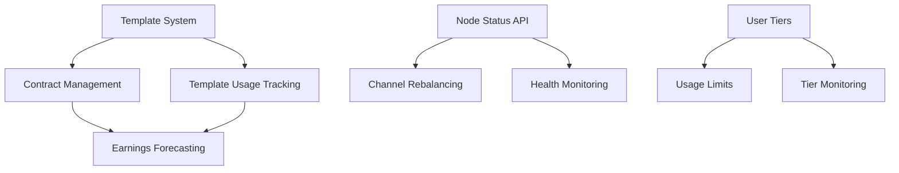

# Lightning AI Platform - Missing Components Roadmap

## 🎯 Overview
This roadmap identifies all missing code components needed to complete the Lightning-powered AI Business OS. Components are prioritized by business impact and technical dependencies.

---

## 🔧 BACKEND / API — Missing Code

### Core Node Management
| Priority | Feature | File/Route | Status | Notes |
|----------|---------|------------|--------|-------|
| 🔴 P0 | Node Health Check | `/api/node/status-check` | Missing | Health + sync status, peers, liquidity monitoring |
| 🔴 P0 | Channel Rebalance | `/api/node/channel-rebalance` | Missing | Auto-rebalance based on volume using LND gRPC |
| 🟡 P1 | Fallback Status | `/api/node/fallback-check` | Missing | BTC fallback status when Lightning fails |
| 🟡 P1 | Route Simulator | `/api/routing/simulator` | Missing | Simulate route earnings + fees (BOS logic) |

### Business Logic APIs
| Priority | Feature | File/Route | Status | Notes |
|----------|---------|------------|--------|-------|
| 🔴 P0 | Template System | `/api/contracts/templates` | Missing | List + fetch templates with RLS per user |
| 🔴 P0 | Template Application | `/api/templates/apply` | Missing | Apply industry pack configurations |
| 🟡 P1 | Contract History | `/api/contracts/history` | Missing | Fetch previously issued contracts/invoices |
| 🟡 P1 | Template Usage Log | `/api/templates/usage-log` | Missing | Performance-based template suggestions |
| 🟢 P2 | Earnings Forecast | `/api/analytics/earnings-forecast` | Missing | Predictive earnings per user/role/channel |

### User Management
| Priority | Feature | File/Route | Status | Notes |
|----------|---------|------------|--------|-------|
| 🟡 P1 | User Tiers | `/api/users/tiers` | Missing | Current tier, upgrade options, usage limits |
| 🟢 P2 | Tier Monitoring | `/api/users/tier-monitor` | Missing | Alert when approaching limits |

---

## 🎨 FRONTEND / UI — Missing Code

### Dashboard Components
| Priority | Component | File Path | Status | Notes |
|----------|-----------|-----------|--------|-------|
| 🔴 P0 | NodeStatusCard | `src/components/dashboard/NodeStatusCard.tsx` | Missing | Live sync, peers, fees, liquidity health |
| 🔴 P0 | ApplyTemplateModal | `src/components/ui/ApplyTemplateModal.tsx` | Missing | Step-by-step config preview for packs |
| 🟡 P1 | EarningsForecast | `src/components/dashboard/EarningsForecast.tsx` | Missing | Dynamic graphs by user type |
| 🟡 P1 | ContractHistoryList | `src/components/payments/ContractHistoryList.tsx` | Missing | List all contracts with payment links |
| 🟡 P1 | TierProgressBar | `src/components/ui/TierProgressBar.tsx` | Missing | SaaS tier status and usage progress |

### Operational Components
| Priority | Component | File Path | Status | Notes |
|----------|-----------|-----------|--------|-------|
| 🟡 P1 | RebalanceButton | `src/components/settings/RebalanceButton.tsx` | Missing | Linked to channel rebalance API |
| 🟡 P1 | FallbackWarningBanner | `src/components/ui/FallbackWarningBanner.tsx` | Missing | BTC fallback trigger UX |
| 🟢 P2 | PassiveNodeSummary | `src/components/dashboard/PassiveNodeSummary.tsx` | Missing | Traffic + relay mode summary |
| 🟢 P2 | TemplateUsageChart | `src/components/analytics/TemplateUsageChart.tsx` | Missing | AI improvements via usage tracking |

---

## 🧠 LOGIC & BACKGROUND JOBS — Missing Code

### Core Workers (BullMQ)
| Priority | Job | File Path | Status | Notes |
|----------|-----|-----------|--------|-------|
| 🔴 P0 | Template Usage Logger | `src/workers/log-template-usage.ts` | Missing | Track template application and modifications |
| 🟡 P1 | Earnings Forecaster | `src/workers/earnings-forecast.ts` | Missing | Calculate based on routes + user type |
| 🟡 P1 | Rebalance Agent | `src/workers/rebalance-agent.ts` | Missing | Monitor channels + trigger rebalance |
| 🟡 P1 | Fallback Monitor | `src/workers/fallback-monitor.ts` | Missing | Track Lightning failures → fallback routes |
| 🟢 P2 | Tier Monitor | `src/workers/tier-monitor.ts` | Missing | Flag users approaching tier limits |

---

## 💼 TEMPLATE SYSTEM — Missing Code

### Industry Packs
| Pack | Priority | Status | Code Needed |
|------|----------|--------|-------------|
| Restaurant | 🔴 P0 | ✅ Implemented | – |
| Barbershop | 🔴 P0 | ✅ Implemented | – |
| Car Rental | 🔴 P0 | ✅ Implemented | – |
| E-commerce | 🟡 P1 | 🟡 Planned | Product returns, BTC tips, order fulfillment QR |
| Coaching | 🟡 P1 | 🟡 Planned | Session contracts, hourly pay, post-call tips |
| Subscription | 🟡 P1 | 🟡 Planned | Auto-pay, expiring access, BTC billing |
| DAO/Guild | 🟢 P2 | 🟡 Planned | Multisig, on-chain proposals, revenue split |
| Creative | 🟢 P2 | 🟡 Planned | Content licensing, AI co-creation, tip jars |
| Medical | 🟢 P2 | 🔒 Legal Review | HIPAA disclaimers, pre-pay, refund logic |

### Template Infrastructure
| Priority | Component | File Path | Status | Notes |
|----------|-----------|-----------|--------|-------|
| 🔴 P0 | Template Engine | `src/lib/templates/engine.ts` | Missing | Core template processing logic |
| 🔴 P0 | Template Validator | `src/lib/templates/validator.ts` | Missing | Validate template configurations |
| 🟡 P1 | Template Marketplace | `src/app/templates/marketplace/page.tsx` | Missing | Browse and install templates |
| 🟡 P1 | Custom Template Builder | `src/app/templates/builder/page.tsx` | Missing | Visual template creation tool |

---

## 🔐 SECURITY & LOGGING — Missing Code

### Security Components
| Priority | Feature | File Path | Status | Notes |
|----------|---------|-----------|--------|-------|
| 🔴 P0 | Contract Validator | `src/lib/security/contract-validator.ts` | Missing | Validate logic before issuing |
| 🔴 P0 | LNURL Abuse Tracker | `src/lib/abuse/lnurl-abuse-tracker.ts` | Missing | Rate limiting and spam detection |
| 🟡 P1 | Node Anomaly Logger | `src/lib/security/node-anomaly.ts` | Missing | Suspicious liquidity/routing patterns |
| 🟡 P1 | User Action Logger | `src/lib/logging/user-action-logger.ts` | Missing | Track key actions (tiers, channels, etc.) |
| 🟢 P2 | Auto Logout Checker | `src/workers/auto-logout.ts` | Missing | Automatic session management |

### Audit & Compliance
| Priority | Feature | File Path | Status | Notes |
|----------|---------|-----------|--------|-------|
| 🟡 P1 | Audit Trail | `src/lib/audit/trail.ts` | Missing | Comprehensive action logging |
| 🟡 P1 | Compliance Checker | `src/lib/compliance/checker.ts` | Missing | Regional compliance validation |
| 🟢 P2 | Privacy Manager | `src/lib/privacy/manager.ts` | Missing | GDPR/CCPA compliance tools |

---

## ⚙️ DEVOPS & DEPLOYMENT — Missing Code

### Setup & Bootstrap Scripts
| Priority | Script | Path | Status | Purpose |
|----------|--------|------|--------|---------|
| 🔴 P0 | Node Bootstrap | `scripts/bootstrap-node.sh` | Missing | Full LND/CLN + Supabase + backup setup |
| 🔴 P0 | System Test | `scripts/test-system.sh` | Missing | Dry-run all endpoints + node health |
| 🟡 P1 | Template Sync | `scripts/sync-template-metadata.ts` | Missing | Push template updates to dashboards |
| 🟡 P1 | Index Rebuild | `scripts/rebuild-index.ts` | Missing | Rebuild template index in Supabase |
| 🟢 P2 | Agent Pack Deploy | `scripts/deploy-agent-pack.sh` | Missing | Deploy AI pack with logic + UI config |

### Monitoring & Maintenance
| Priority | Script | Path | Status | Purpose |
|----------|--------|------|--------|---------|
| 🟡 P1 | Health Monitor | `scripts/health-monitor.sh` | Missing | Continuous system health checks |
| 🟡 P1 | Backup Manager | `scripts/backup-manager.sh` | Missing | Automated backup and restore |
| 🟢 P2 | Performance Profiler | `scripts/performance-profile.ts` | Missing | System performance analysis |

---

## 📊 DATABASE SCHEMA — Missing Tables

### Core Tables
| Priority | Table | Purpose | Status |
|----------|-------|---------|--------|
| 🔴 P0 | `templates` | Store industry pack configurations | Missing |
| 🔴 P0 | `template_usage` | Track template application and performance | Missing |
| 🔴 P0 | `contracts` | Store issued contracts and their status | Missing |
| 🟡 P1 | `node_health` | Historical node performance data | Missing |
| 🟡 P1 | `user_tiers` | SaaS tier management and limits | Missing |
| 🟡 P1 | `earnings_forecasts` | Predictive earnings data | Missing |
| 🟢 P2 | `audit_logs` | Comprehensive action logging | Missing |

---

## 🎯 IMPLEMENTATION PRIORITY MATRIX

### Phase 1: Core Infrastructure (Weeks 1-2)
- ✅ Node Status Check API
- ✅ Template System Foundation
- ✅ NodeStatusCard Component
- ✅ Basic Template Application

### Phase 2: Business Logic (Weeks 3-4)
- ✅ Contract Management
- ✅ Template Usage Tracking
- ✅ User Tier System
- ✅ Earnings Forecasting

### Phase 3: Advanced Features (Weeks 5-8)
- ✅ Channel Rebalancing
- ✅ Advanced Templates (E-commerce, Coaching)
- ✅ Security Enhancements
- ✅ Monitoring & Analytics

### Phase 4: Scale & Polish (Weeks 9-12)
- ✅ Performance Optimization
- ✅ Advanced Security
- ✅ Compliance Features
- ✅ Enterprise Templates

---

## 🚀 QUICK WINS (Can be implemented in 1-2 days each)

1. **NodeStatusCard** - Visual node health display
2. **TierProgressBar** - SaaS usage visualization
3. **Template Usage Logger** - Basic tracking worker
4. **Contract History API** - Simple CRUD operations
5. **Fallback Warning Banner** - UX improvement

---

## 🔥 CRITICAL PATH DEPENDENCIES

---

## 📈 SUCCESS METRICS

### Technical KPIs
- **API Coverage**: 100% of planned endpoints implemented
- **Component Coverage**: All UI components functional
- **Test Coverage**: >80% for critical paths
- **Performance**: <2s API response times

### Business KPIs
- **Template Adoption**: >70% users apply at least one template
- **Node Health**: >99% uptime across all monitored nodes
- **User Satisfaction**: >4.5/5 rating for new features
- **Revenue Impact**: 25% increase in user tier upgrades

---

*Last Updated: 2024-05-28*
*Next Review: Weekly during development phases* 