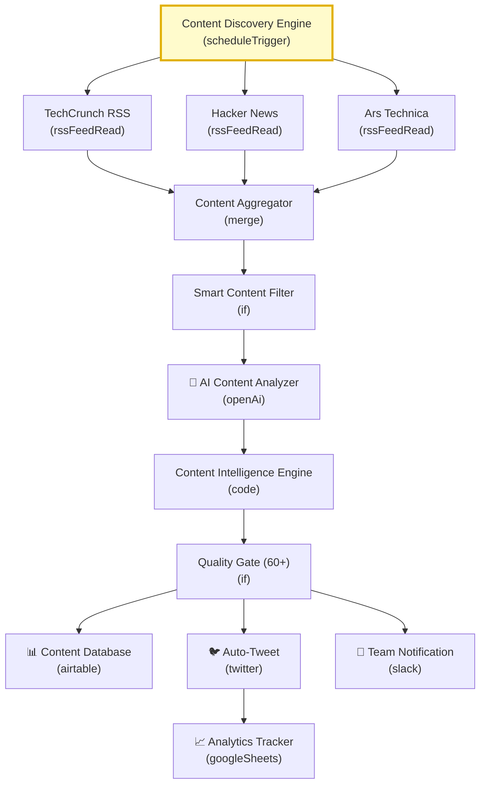

# 🚀 AI Content Empire - Multi-Platform Automation

```mermaid
flowchart TD
    content_discovery_engine["Content Discovery Engine<br/>(scheduleTrigger)"]
    techcrunch_rss["TechCrunch RSS<br/>(rssFeedRead)"]
    hacker_news["Hacker News<br/>(rssFeedRead)"]
    ars_technica["Ars Technica<br/>(rssFeedRead)"]
    content_aggregator["Content Aggregator<br/>(merge)"]
    smart_content_filter["Smart Content Filter<br/>(if)"]
    ai_content_analyzer["🤖 AI Content Analyzer<br/>(openAi)"]
    content_intelligence_engine["Content Intelligence Engine<br/>(code)"]
    quality_gate_60["Quality Gate (60+)<br/>(if)"]
    content_database["📊 Content Database<br/>(airtable)"]
    auto_tweet["🐦 Auto-Tweet<br/>(twitter)"]
    team_notification["📢 Team Notification<br/>(slack)"]
    analytics_tracker["📈 Analytics Tracker<br/>(googleSheets)"]

    content_discovery_engine --> techcrunch_rss
    content_discovery_engine --> hacker_news
    content_discovery_engine --> ars_technica
    techcrunch_rss --> content_aggregator
    hacker_news --> content_aggregator
    ars_technica --> content_aggregator
    content_aggregator --> smart_content_filter
    smart_content_filter --> ai_content_analyzer
    ai_content_analyzer --> content_intelligence_engine
    content_intelligence_engine --> quality_gate_60
    quality_gate_60 --> content_database
    quality_gate_60 --> auto_tweet
    quality_gate_60 --> team_notification
    auto_tweet --> analytics_tracker

    style content_discovery_engine fill:#fffbcc,stroke:#e1b000,stroke-width:3px
```

**Status:** 🔴 Inactive
**Last Updated:** 8/18/2025, 1:04:04 PM
**Nodes:** 13 | **Triggers:** 1

