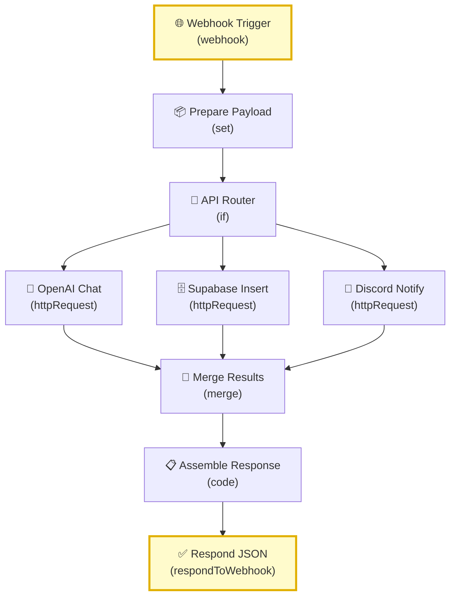

# 🚀 AI SaaS Master Scaffold

```mermaid
flowchart TD
    webhook_trigger["🌐 Webhook Trigger<br/>(webhook)"]
    prepare_payload["📦 Prepare Payload<br/>(set)"]
    api_router["🔀 API Router<br/>(if)"]
    openai_chat["🤖 OpenAI Chat<br/>(httpRequest)"]
    supabase_insert["🗄️ Supabase Insert<br/>(httpRequest)"]
    discord_notify["💬 Discord Notify<br/>(httpRequest)"]
    merge_results["🔄 Merge Results<br/>(merge)"]
    assemble_response["📋 Assemble Response<br/>(code)"]
    respond_json["✅ Respond JSON<br/>(respondToWebhook)"]

    webhook_trigger --> prepare_payload
    prepare_payload --> api_router
    api_router --> openai_chat
    api_router --> supabase_insert
    api_router --> discord_notify
    openai_chat --> merge_results
    supabase_insert --> merge_results
    discord_notify --> merge_results
    merge_results --> assemble_response
    assemble_response --> respond_json

    style webhook_trigger fill:#fffbcc,stroke:#e1b000,stroke-width:3px
    style respond_json fill:#fffbcc,stroke:#e1b000,stroke-width:3px
```

**Status:** 🟢 Active
**Last Updated:** 8/18/2025, 1:20:46 PM
**Nodes:** 9 | **Triggers:** 2

