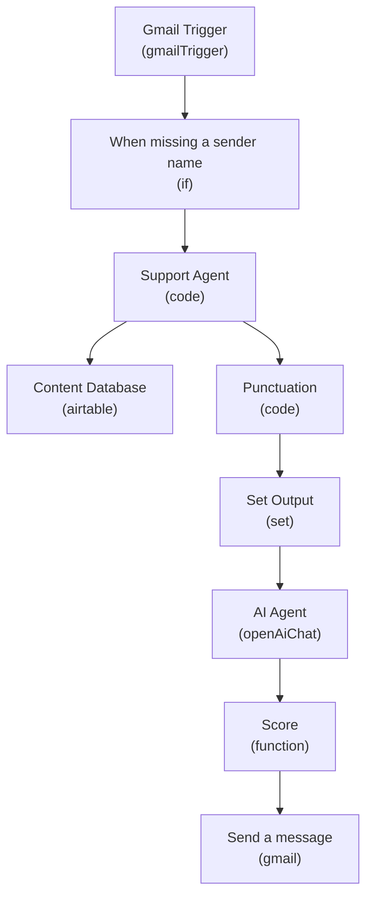

# GPT-5 Support Agent

```mermaid
flowchart TD
    gmail_trigger["Gmail Trigger<br/>(gmailTrigger)"]
    when_missing_a_sender_name["When missing a sender name<br/>(if)"]
    support_agent["Support Agent<br/>(code)"]
    content_database["Content Database<br/>(airtable)"]
    punctuation["Punctuation<br/>(code)"]
    set_output["Set Output<br/>(set)"]
    ai_agent["AI Agent<br/>(openAiChat)"]
    score["Score<br/>(function)"]
    send_a_message["Send a message<br/>(gmail)"]

    gmail_trigger --> when_missing_a_sender_name
    when_missing_a_sender_name --> support_agent
    support_agent --> punctuation
    support_agent --> content_database
    punctuation --> set_output
    set_output --> ai_agent
    ai_agent --> score
    score --> send_a_message

```

**Status:** 🔴 Inactive
**Last Updated:** 8/18/2025, 8:11:48 PM
**Nodes:** 9 | **Triggers:** 0

