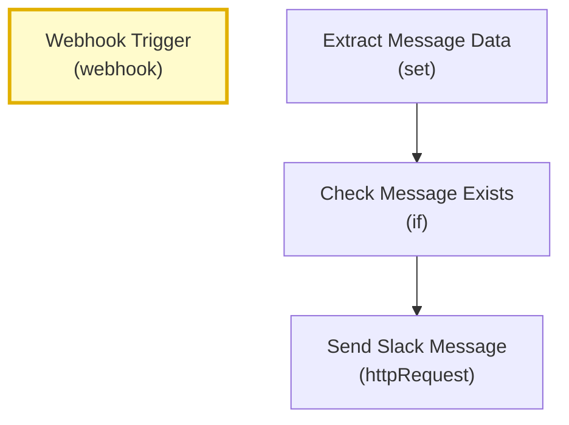
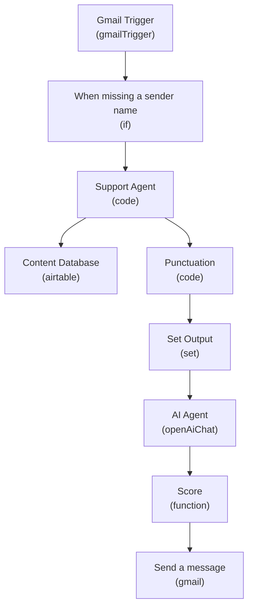
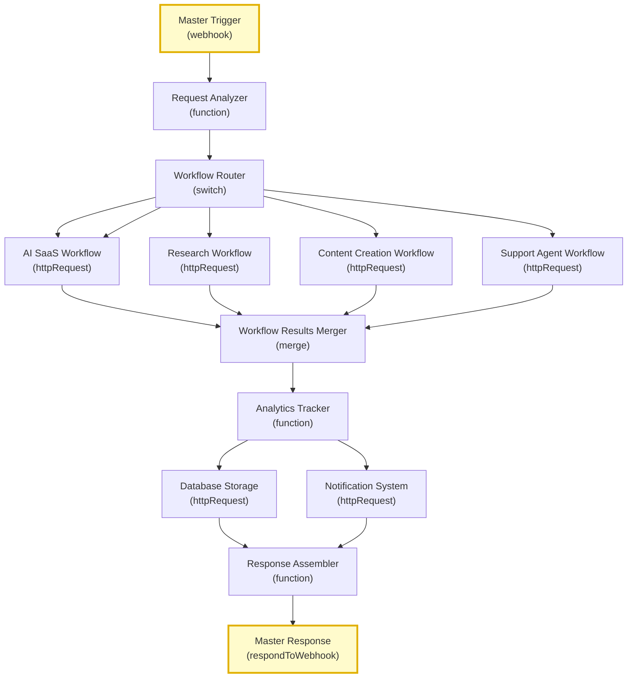
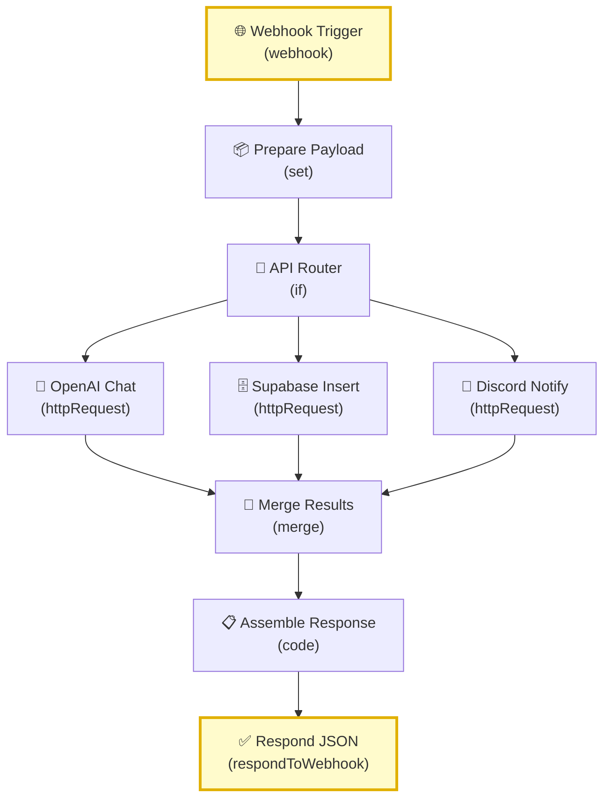
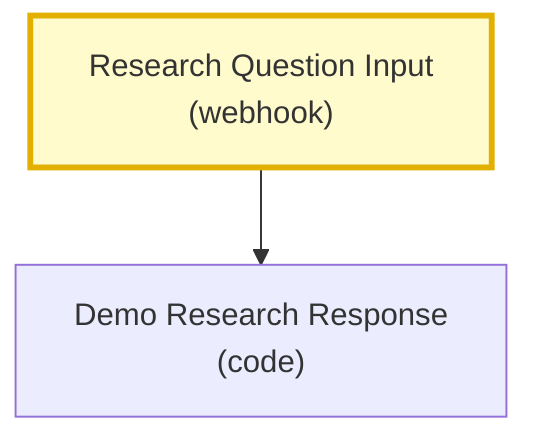
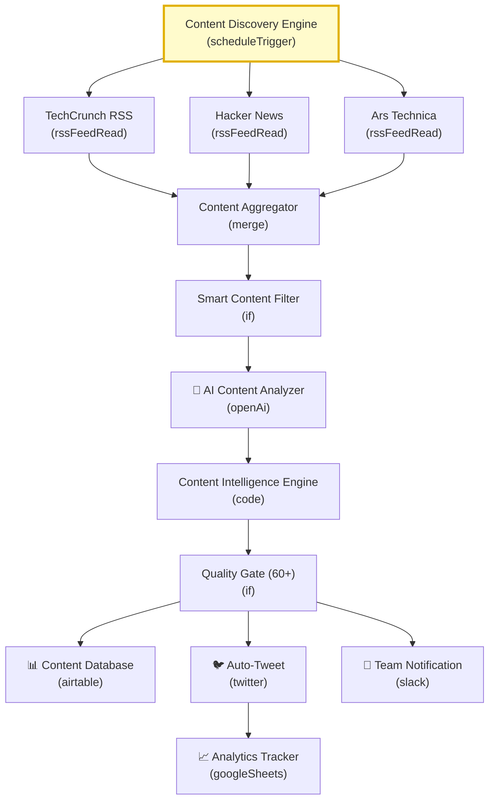

# 🔄 n8n Workflow Visualizations

*Auto-generated on 8/18/2025, 8:11:48 PM*

## Quick Stats
- **Total Workflows:** 6
- **Active Workflows:** 2
- **Total Nodes:** 50

## 📋 Table of Contents

| Workflow | Status | Nodes | Last Updated | Diagram |
|----------|--------|-------|--------------|---------|
| **Simple Slack Notifier** | 🔴 Inactive | 4 | 8/18/2025 | [View](simple_slack_notifier.md) |
| **GPT-5 Support Agent** | 🔴 Inactive | 9 | 8/18/2025 | [View](gpt5-support-agent.md) |
| **Master Orchestration System** | 🔴 Inactive | 13 | 8/18/2025 | [View](master-orchestration-system.md) |
| **🚀 AI SaaS Master Scaffold** | 🟢 Active | 9 | 8/18/2025 | [View](ai-saas-master-scaffold.md) |
| **AI Research Agent Demo** | 🟢 Active | 2 | 8/18/2025 | [View](ai-research-agent.md) |
| **🚀 AI Content Empire - Multi-Platform Automation** | 🔴 Inactive | 13 | 8/18/2025 | [View](ai-content-empire.md) |

---

## 🖼️ Workflow Diagrams

### Simple Slack Notifier

# Simple Slack Notifier

**Status:** 🔴 Inactive
**Last Updated:** 8/18/2025, 8:11:48 PM
**Nodes:** 4 | **Triggers:** 1

---

### GPT-5 Support Agent

# GPT-5 Support Agent

**Status:** 🔴 Inactive
**Last Updated:** 8/18/2025, 8:11:48 PM
**Nodes:** 9 | **Triggers:** 0

---

### Master Orchestration System

# Master Orchestration System

**Status:** 🔴 Inactive
**Last Updated:** 8/18/2025, 8:11:48 PM
**Nodes:** 13 | **Triggers:** 2

---

### 🚀 AI SaaS Master Scaffold

# 🚀 AI SaaS Master Scaffold

**Status:** 🟢 Active
**Last Updated:** 8/18/2025, 1:20:46 PM
**Nodes:** 9 | **Triggers:** 2

---

### AI Research Agent Demo

# AI Research Agent Demo

**Status:** 🟢 Active
**Last Updated:** 8/18/2025, 1:14:42 PM
**Nodes:** 2 | **Triggers:** 1

---

### 🚀 AI Content Empire - Multi-Platform Automation

# 🚀 AI Content Empire - Multi-Platform Automation

**Status:** 🔴 Inactive
**Last Updated:** 8/18/2025, 1:04:04 PM
**Nodes:** 13 | **Triggers:** 1

---

## 🔧 Tools & Commands

- **Regenerate All:** `npm run gen`
- **Start Watcher:** `npm run watch`
- **Sync to GitHub:** `npm run sync`
- **View Backups:** Check `backups/` folder

*This page updates automatically when workflows change.*
