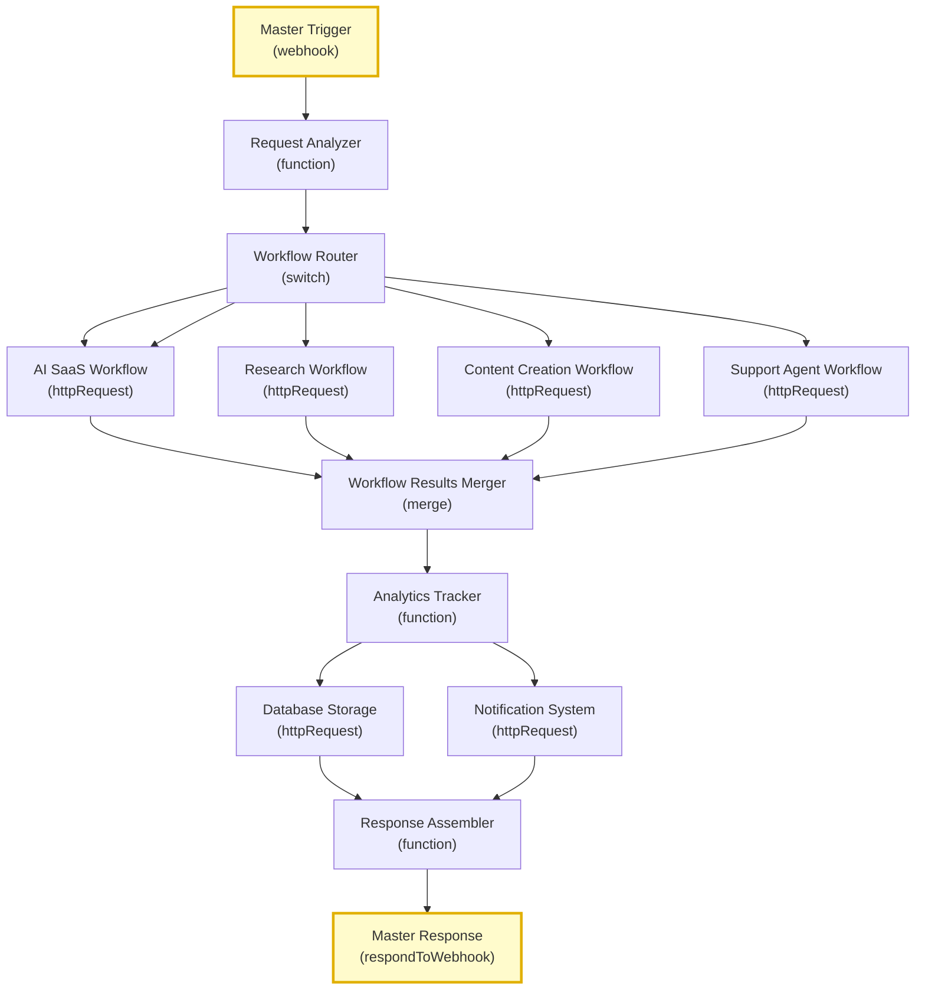

# Master Orchestration System

```mermaid
flowchart TD
    master_trigger["Master Trigger<br/>(webhook)"]
    request_analyzer["Request Analyzer<br/>(function)"]
    workflow_router["Workflow Router<br/>(switch)"]
    ai_saas_workflow["AI SaaS Workflow<br/>(httpRequest)"]
    research_workflow["Research Workflow<br/>(httpRequest)"]
    content_creation_workflow["Content Creation Workflow<br/>(httpRequest)"]
    support_agent_workflow["Support Agent Workflow<br/>(httpRequest)"]
    workflow_results_merger["Workflow Results Merger<br/>(merge)"]
    analytics_tracker["Analytics Tracker<br/>(function)"]
    database_storage["Database Storage<br/>(httpRequest)"]
    notification_system["Notification System<br/>(httpRequest)"]
    response_assembler["Response Assembler<br/>(function)"]
    master_response["Master Response<br/>(respondToWebhook)"]

    master_trigger --> request_analyzer
    request_analyzer --> workflow_router
    workflow_router --> ai_saas_workflow
    workflow_router --> research_workflow
    workflow_router --> content_creation_workflow
    workflow_router --> support_agent_workflow
    workflow_router --> ai_saas_workflow
    ai_saas_workflow --> workflow_results_merger
    research_workflow --> workflow_results_merger
    content_creation_workflow --> workflow_results_merger
    support_agent_workflow --> workflow_results_merger
    workflow_results_merger --> analytics_tracker
    analytics_tracker --> database_storage
    analytics_tracker --> notification_system
    database_storage --> response_assembler
    notification_system --> response_assembler
    response_assembler --> master_response

    style master_trigger fill:#fffbcc,stroke:#e1b000,stroke-width:3px
    style master_response fill:#fffbcc,stroke:#e1b000,stroke-width:3px
```

**Status:** 🔴 Inactive
**Last Updated:** 8/18/2025, 8:11:48 PM
**Nodes:** 13 | **Triggers:** 2

