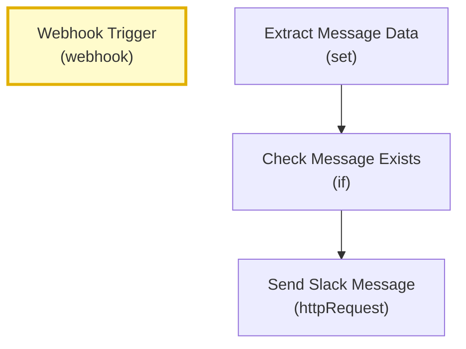

# Simple Slack Notifier

```mermaid
flowchart TD
    webhook_trigger["Webhook Trigger<br/>(webhook)"]
    extract_message_data["Extract Message Data<br/>(set)"]
    check_message_exists["Check Message Exists<br/>(if)"]
    send_slack_message["Send Slack Message<br/>(httpRequest)"]

    extract_message_data --> check_message_exists
    check_message_exists --> send_slack_message

    style webhook_trigger fill:#fffbcc,stroke:#e1b000,stroke-width:3px
```

**Status:** 🔴 Inactive
**Last Updated:** 8/18/2025, 8:11:48 PM
**Nodes:** 4 | **Triggers:** 1

