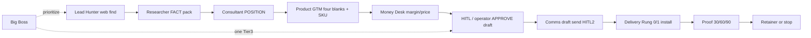

# E2E AI Partner business workflows
**Parent:** [PACKET.md](./PACKET.md) · **Date:** 2026-08-12 · **Agent:** Researcher  
Labels: **FACT** · **INFERENCE** · **OPINION** · **UNVERIFIED**

---

## Master spine (lead → retainer)

| Stage | Owner | Artifact | Done when | Label |
|-------|-------|----------|-----------|-------|
| 1 Find | Lead Hunter | Prospect URL + constraint sentence + contact | Web-only; no CE | FACT (hive gate seq) |
| 2 Pack | Researcher | `research-packets/<slug>/PACKET.md` | FACT/INFERENCE; MUST score | FACT |
| 3 POSITION | Consultant | Constraint, adoption risk, reversible step | #14 brand etc resolved | FACT |
| 4 SKU | Product GTM | Four blanks + rung + one-pager CTA | Inside band | FACT |
| 5 Economics | Money Desk | Margin ≤40%; pain UNVERIFIED; cash path | APPROVE or HOLD | FACT |
| 6 Draft approve | HITL Operator + you | Warm draft approved | Tier 3 | FACT |
| 7 Send | Comms Manager | Sent only after 2nd HITL | No auto-send | FACT |
| 8 Delivery | Forge only if needed; else workflow install | Loom + live book/CTA | DONE_WHEN ≤60d | OPINION |
| 9 Proof | Consultant + Money Desk + GTM | 30/60/90 KPI check | Renew / upsell / stop | FACT (Nate pattern) |
| 10 Retainer | Money Desk + GTM | KPI watch scope | After first win only | Money Desk SoT |

**OPINION:** Never skip POSITION→Money Desk before HITL. Feature requests that aren’t constraints die at Consultant.

---

## Workflow A — Prospect scoring / qualification

1. LH fills A+C evidence (URL, contact, one-sentence constraint).  
2. Researcher scores MUST 0/1 vs `prospect-qualification-criteria-20260812.md`.  
3. If any MUST=0 → HOLD + gap list (not “more vibes”).  
4. Consultant rules brand/adoption (#14).  
5. Money Desk rules economics.  

**Artifact:** score table in PACKET (see Janet Hoyt / SBF examples).  
**Trap:** BANT ranking without public leakage evidence.

---

## Workflow B — Discovery call (operator + Consultant assist)

**Script shape (SPICED-lite + constraint):**
1. Situation — what does a busy week look like for leads/admin?  
2. Pain — where do you sigh? (inbox, no-shows, DMs)  
3. Impact — what slips (revenue, hours, reputation)? **numbers = their words only**  
4. Critical event — hiring, launch, capacity, bad week  
5. Decision — who says yes; timeline  
6. Close reversible step — Rung 0 sandbox / private book test  

**Outputs:** call notes → update four blanks → CONFIRM or WALK.  
**OPINION:** If they love “AI agents” but deny ops pain → walk or education-only.

---

## Workflow C — ROI memo / audit deck

| Piece | Owner | Content rules |
|-------|-------|---------------|
| Constraint brief | Consultant | One sentence + evidence URLs |
| Four blanks | GTM | Bucket · KPI · Baseline · 60d target |
| Pain $ | Money Desk | Always **UNVERIFIED** until owner numbers |
| 5-slide ROI outline | Consultant (+ Mert pattern) | Systems→Teams→AI last; no chatbot race |
| Reversible install | GTM/Forge brief | Private book / CTA — not redesign |

**FACT pattern:** Mert paid audit before build; Nate prove 30/60/90.  
**UNVERIFIED:** any educator close-rate or $10K audit averages as *your* price.

---

## Workflow D — SKU packaging (shrink scope not price)

1. Start Rung 0 or 1 band (CAD $750–3.5K).  
2. If scope creeps → cut features, keep price (or move to Rung 2 with Forge + DONE_WHEN).  
3. Maintenance ≠ new features (Nate).  
4. Client owns accounts/keys.  

---

## Workflow E — HITL dual-gate send

1. Money Desk/GTM green → HITL Operator surfaces draft.  
2. Operator APPROVE draft.  
3. Comms prepares send **as operator voice** (sample channel style).  
4. Second HITL before actual send.  
5. No CE, no auto-DM, no “meanwhile” fan-out.  

---

## Workflow F — Delivery → proof → retainer

| Day | Action | Proof |
|-----|--------|-------|
| 0–7 | Install private book / CTA / alerts; Loom | Link live |
| 30 | KPI: time-to-first-touch, book rate, reply SLA | Spreadsheet / board |
| 60 | Adjust rules; kill unused automations | Changelog |
| 90 | Keep / expand Rung 2 / retainer $500–1K/mo early band | Money Desk |

**Walk away after proof if:** no usage, no pain, wants ads empire.

---

## Constraint finding vs feature traps

| Constraint finding (do) | Feature trap (don’t) |
|-------------------------|----------------------|
| “Inquiries don’t become booked calls” | “Build me a custom CRM” |
| “DMs get lost while I’m with clients” | “17 agents running my firm” |
| “Apply page 404s” | “Cinematic site like a $50k agency” first |
| “I reply in 2 days and lose heat” *if they hate that* | Automating a premium intentional delay they cherish |

**OPINION:** Hoyt-class = diagnose intentional SLA before selling speed.

---

## Sources
- Gate sequence in prospect-qualification-criteria-20260812.md  
- Nate / Mert / Liam dossiers (CONTENT/)  
- Hive demos: cinematic, MCP, speed-to-lead PR #39  
- Money Desk ladder draft 20260812  
