# CAPTIONS — FFWtxjvW2ts presentation beats

**Skill:** `goal-directed-watch` (Consultant sitting 2026-09-02). Not a fixed-fps dump.
**Evidence:** ffmpeg stills from a local 720p source + on-disk captions. Clicks UNKNOWN.
**Cap:** 22 beats · one video. Recut when the first seek was still talking-head or the wrong tab.

## 1. `00:07` — 01-ais-layers.jpg

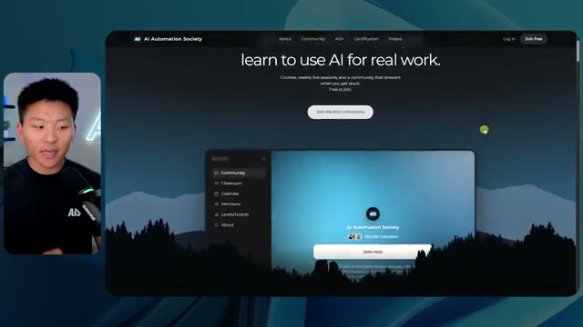

**Cue:** AIS layered hero as he starts to scroll

**Spoken window (±4s):**

```
[00:03] AI Automation Society site. What I think
[00:05] is so cool about this one is look at the
[00:07] layers as I start to scroll. We can see
[00:08] the mountains in the background and this
[00:10] like treeine and they are clearly
```

## 2. `00:31` — 02-ais-cards-stack.jpg

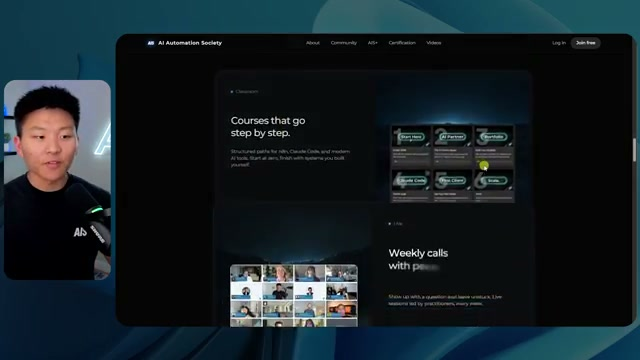

**Cue:** cards start to stack

**Spoken window (±4s):**

```
[00:28] scrolling, more text keeps coming in
[00:30] dynamically and these cards start to
[00:31] stack on top of each other, which I
[00:33] think just feels super super dynamic and
```

## 3. `00:44` — 03-ais-faq-lock.jpg

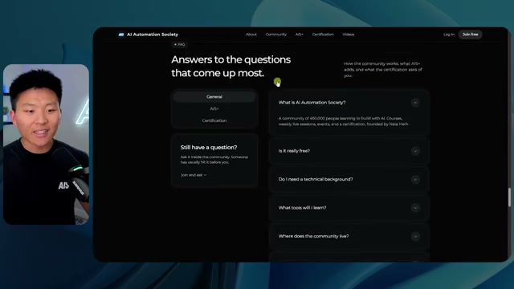

**Cue:** FAQ text lock animation

**Spoken window (±4s):**

```
[00:41] some Q&A down here or FAQ, sorry. And
[00:44] look at this animation where the text
[00:45] sort of like locks as we switch between
[00:47] these different things. I think that's
[00:48] awesome. We see some YouTube videos and
```

## 4. `00:51` — 04-ais-cta-layers.jpg

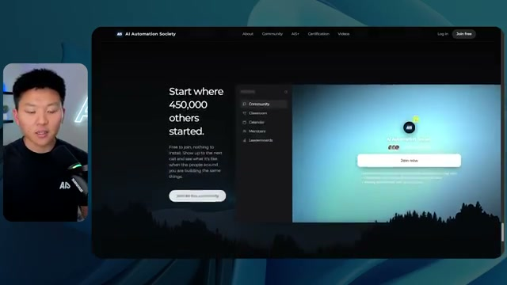

**Cue:** CTA with layering coming back

**Spoken window (±4s):**

```
[00:47] these different things. I think that's
[00:48] awesome. We see some YouTube videos and
[00:50] then finally the call to action down
[00:51] here with once again the layering comes
[00:54] back in. And I just think that that is
[00:55] so so cool. And I know you guys are
```

## 5. `00:59` — 05-ais-mobile.jpg

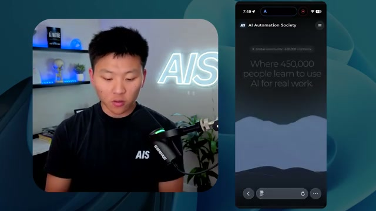

**Cue:** mobile / phone view of AIS

**Spoken window (±4s):**

```
[00:55] so so cool. And I know you guys are
[00:57] probably wondering on mobile. So here it
[00:59] is right here. This is me on my phone.
[01:01] We get the same dynamic laptop screen.
[01:02] We get the same layered effect, which I
```

## 6. `01:32` — 06-nate-hero.jpg


**Cue:** Nate personal hero + ticking numbers

**Spoken window (±4s):**

```
[01:28] that this website is beautiful. Let's
[01:30] take a look at another example here.
[01:32] This is my website. You can see we've
[01:34] got the text. We've got the hero
[01:35] section. Those numbers were sort of like
[01:36] ticking up. I've got myself over here
```

## 7. `01:53` — 07-nate-mouse.jpg

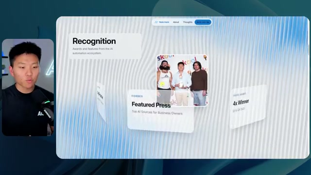

**Cue:** mouse-reactive depth

**Spoken window (±4s):**

```
[01:49] through these things color up as I
[01:51] highlight. We get into this interesting
[01:53] like dynamic element. You can see when I
[01:55] move my mouse, these move, but once
[01:56] again, it's not too overwhelming or
```

## 8. `02:38` — 08-nate-sticky-nav.jpg

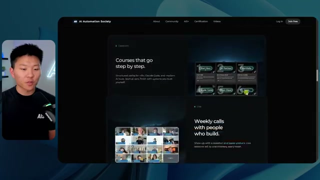

**Cue:** sticky / locked nav

**Spoken window (±4s):**

```
[02:34] AIS um site, which I really, really
[02:36] like. I don't know why. It just feels a
[02:38] bit more like having it locked there
[02:40] just feels good. Now, let me show you
[02:41] guys this next one, which is Glido. I
[02:42] think this one is so cool because look
```

## 9. `02:54` — 09-glido-apps.jpg

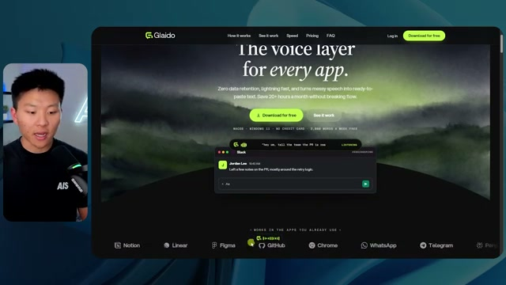

**Cue:** Glido product-in-use apps

**Spoken window (±4s):**

```
[02:50] similar to the way that you can actually
[02:52] see me talking into my mic right now.
[02:54] And right here, you can see that I'm
[02:55] dictating with Glyo. So, super super
[02:57] cool. We can have the apps right here
[02:58] that we already use and it pauses when
```

## 10. `03:29` — 10-glido-favorite.jpg

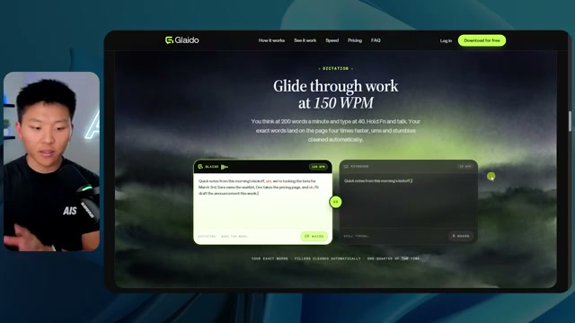

**Cue:** Glido favorite animation

**Spoken window (±4s):**

```
[03:26] over here or speaking over here as well
[03:28] as just like typing the difference right
[03:29] there. And now this is my favorite part.
[03:32] As we go down, which is this animation,
```

## 11. `04:32` — 11-fora-layers.jpg

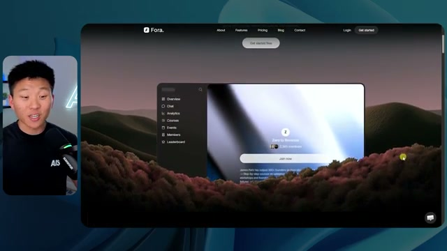

**Cue:** Fora living inspiration — four planes

**Spoken window (±4s):**

```
[04:28] very similar. You can see it has hero
[04:29] text. It has the layers in the
[04:31] background. Then when I started to
[04:32] scroll, I was like, "Wow, I love the
[04:34] layering here." So I told Fable 5.1 how
[04:36] to figure out how we could make a hero
```

## 12. `05:32` — 12-21st-dev.jpg

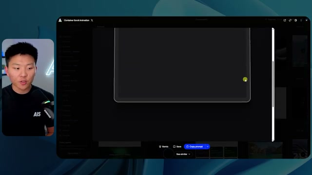

**Cue:** 21st.dev Container Scroll + Copy prompt

**Spoken window (±4s):**

```
[05:28] agents the prompts for these animations.
[05:30] So for example, this container scroll,
[05:32] you can just copy prompt and then your
[05:34] agent can basically copy that element.
[05:36] So I was looking at backgrounds that I
```

## 13. `05:36` — 13-21st-container-scroll.jpg

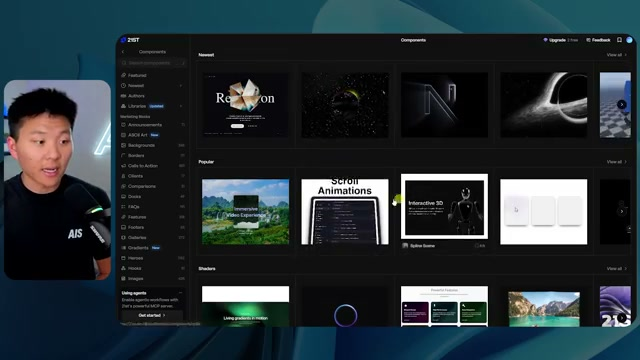

**Cue:** 21st.dev copy-prompt on the component

**Spoken window (±4s):**

```
[05:32] you can just copy prompt and then your
[05:34] agent can basically copy that element.
[05:36] So I was looking at backgrounds that I
[05:38] really liked here. I was looking at
[05:39] different gradients. I was looking at
```

## 14. `06:21` — 14-lemon-clone.jpg

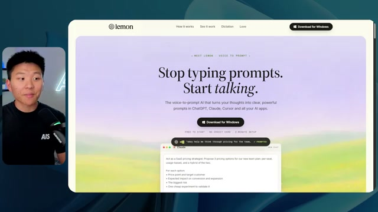

**Cue:** Lemon competitor feel (watercolor / talk-to-prompt)

**Spoken window (±4s):**

```
[06:17] inside of that skill. It's completely
[06:18] free. And then for GLO, what I actually
[06:20] did is we looked at a competitor site.
[06:21] So we looked at Lemon, which is another
[06:23] dictation app, and I loved how it had
[06:24] these animations that almost give you
```

## 15. `07:28` — 15-godly-design.jpg

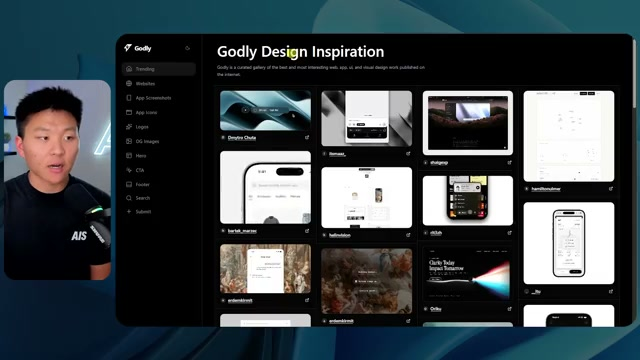

**Cue:** godly.design gallery (heroes/CTAs/OG)

**Spoken window (±4s):**

```
[07:25] inspiration. If I go to actually godly
[07:28] websites, you can see godly.design. We
[07:30] can find trending sites. We can find um
```

## 16. `07:51` — 16-awards-by-niche.jpg

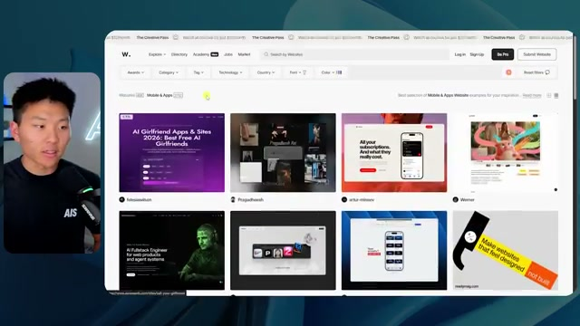

**Cue:** awards / Awwwards-style filter by niche

**Spoken window (±4s):**

```
[07:48] you can just understand what kind of
[07:50] feel do you want. You know, there's
[07:51] different categories in here um you know
[07:53] technology, e-commerce, restaurant,
[07:55] fashion because obviously your site
```

## 17. `08:08` — 21-motion-sites.jpg

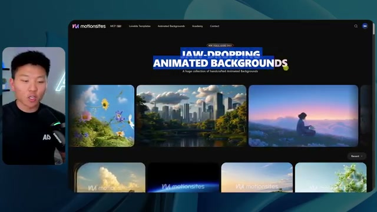

**Cue:** Motion Sites jaw-dropping animated backgrounds

**Spoken window (±4s):**

```
[08:05] There's literally another site called
[08:06] Motion Sites that has like these
[08:07] jaw-dropping animated backgrounds that
[08:09] you can actually go ahead and grab and
[08:11] just bring right into your websites. I
```

## 18. `08:59` — 17-ferna-hero.jpg

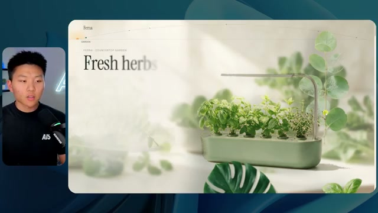

**Cue:** Ferna one-shot — herbs / layered product

**Spoken window (±4s):**

```
[08:55] And I just said, "Go make me these
[08:56] sites." So let's take a look at what it
[08:58] actually built. So, this first one's
[08:59] called Ferna, fresh herbs without the
[09:01] window sill. You can already see right
[09:03] away from the beginning, we have
```

## 19. `09:26` — 18-ferna-scroll-video.jpg

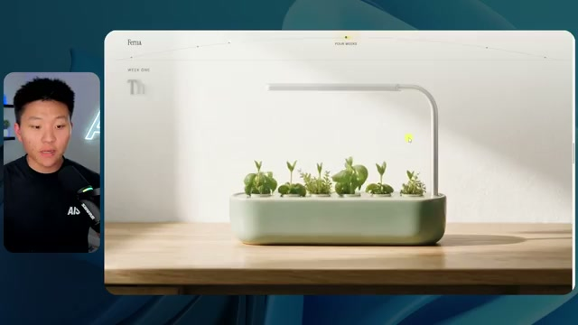

**Cue:** Ferna grow-on-scroll video

**Spoken window (±4s):**

```
[09:23] looks amazing. We can see right here we
[09:26] have a little scroll video now where
[09:27] this literally grows over time and we
[09:29] can go backwards. I like how this feels.
```

## 20. `09:46` — 19-lowkey-hero.jpg

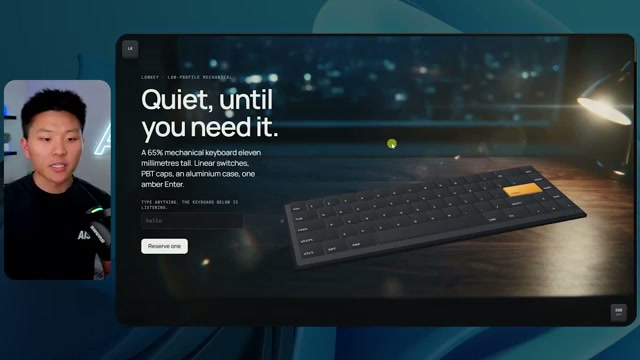

**Cue:** Lowkey one-shot — keyboard

**Spoken window (±4s):**

```
[09:42] That was a oneshot prompt with
[09:44] Scrollcraft. Okay. And then the second
[09:46] one it made, this one is called Lowkey.
[09:48] It's a keyboard. Let me just refresh
[09:50] this. So we see the text comes in like
```

## 21. `10:05` — 20-lowkey-hard-cut.jpg

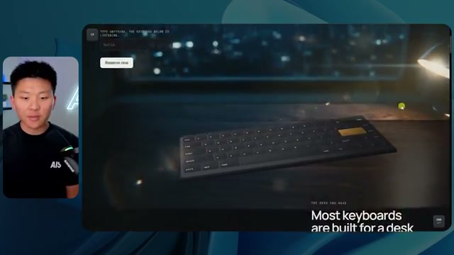

**Cue:** Lowkey hard cut (D7 leftover)

**Spoken window (±4s):**

```
[10:02] background is moving as well as the
[10:03] actual keyboard. Now, this is something
[10:05] I don't like. You can see there's like a
[10:06] hard cut right here. So, on more of a
[10:09] verification loop and on more of like a
```

## 22. `14:00` — 22-fable-compare-sites.jpg

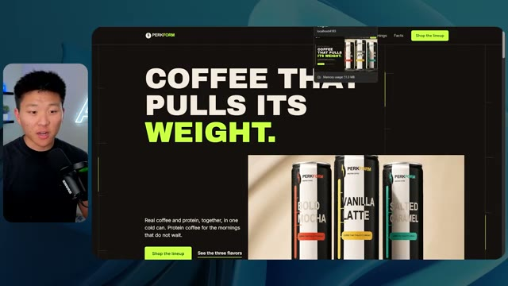

**Cue:** PERKFORM one-shot — same skill/assets compare family

**Spoken window (±4s):**

```
[13:56] I did like, you know, these perk form
[13:58] sites right here. This one was Fable
[14:00] 5.1. This one was Fable 5. This one was
[14:02] Fable 5. This one was Fable 5.1. They
[14:04] just felt very similar. Like none of
```

