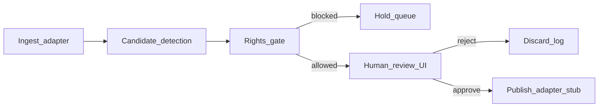

# ClipEngine architecture (Phase 13)

**Repo:** `clipengine`  
**Lane:** `product_candidate`  
**Hard rule:** one stream clipper — ClipEngine ≠ Bookflix (`book-reimagined`) ≠ OpenClaw `#creator` (423).

## Pipeline

## Components

| Stage | Responsibility | Notes |
|-------|----------------|-------|
| **Ingest** | One stream source adapter (VOD/live clip buffer) | Resource-capped; must not starve hive VPS |
| **Detect** | Candidate clip windows (MVP heuristics OK) | No auto-publish |
| **Rights gate** | Policy/blocklist before review | Never auto-publish rules |
| **Review UI** | Human approve/reject + notes | Operator-only |
| **Publish stub** | Manual confirm adapter | Real networks later under HITL |

## Non-goals

- Not Bookflix scene reimagining
- Not OpenClaw `#creator` content ops topic
- Not CE money OS / invoice path
- No apex path on `evenslouis.ca` until own-domain decision

## Demo checklist

- [ ] Architecture doc reviewed (this file)
- [ ] One ingest source wired
- [ ] At least one candidate clip detected from sample
- [ ] Rights blocklist rejects a known-bad case
- [ ] Human review approve path reaches publish stub
- [ ] Non-overlap asserted vs Bookflix + `#creator`
- [ ] Demo logged via Scorpion `POST /api/hive/register` or CE work item
- [ ] `/work` maturity updated if warranted (`repo-registry.ts` / `product-registry.ts`)

## Registry / portfolio

- Public story: GitHub + `/work` badge only until domain decision
- Prefer GitHub-only demo unless Phase 13 explicitly chooses a demo domain
