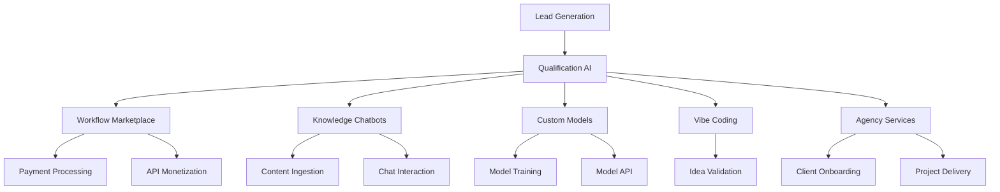
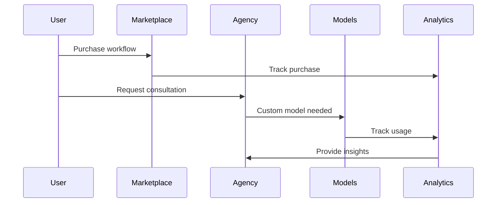

# Workflow Overview & Documentation

## Architecture Overview

The AI Business Automation Hub consists of 9 core workflows organized into 5 business domains. Each workflow is designed to be modular, scalable, and production-ready.

## Workflow Categories

### 1. Marketplace Operations (`01-marketplace/`)

#### Payment Processing Workflow
**File:** `payment-processing.json`

**Purpose:** Handles Stripe webhook payments and automatically delivers workflow templates to customers.

**Key Features:**
- Stripe payment verification
- Automatic email delivery with attachments
- Purchase tracking and analytics
- Error handling and retry logic

**Trigger:** Stripe webhook (`/payment-received`)

**Flow:**
1. Receive Stripe webhook
2. Verify payment status
3. Query workflow database
4. Send workflow file via email
5. Update purchase records
6. Track analytics

**Configuration Required:**
- Stripe API credentials
- Email server (SMTP)
- PostgreSQL database
- Mixpanel analytics (optional)

#### Workflow-as-a-Service API
**File:** `workflow-as-service.json`

**Purpose:** Provides API endpoints for customers to execute AI workflows programmatically.

**Key Features:**
- API key authentication
- Usage tracking and billing
- Multiple AI workflow endpoints
- Rate limiting and quotas

**Trigger:** HTTP POST (`/run-workflow/{workflow_id}`)

**Supported Workflows:**
- Lead generation AI
- Content optimization AI
- Email automation AI

**Configuration Required:**
- OpenAI API credentials
- PostgreSQL for usage tracking
- Custom API key management

### 2. Knowledge Chatbots (`02-knowledge-chatbots/`)

#### Knowledge Ingestion Pipeline
**File:** `knowledge-ingestion.json`

**Purpose:** Processes various content types (PDF, websites, YouTube, text) into searchable knowledge bases.

**Key Features:**
- Multi-format content processing
- Automatic text extraction
- Vector embedding generation
- Pinecone integration for storage

**Trigger:** HTTP POST (`/upload-content`)

**Content Types Supported:**
- PDF documents
- Website scraping
- YouTube transcripts
- Direct text input

**Configuration Required:**
- OpenAI embeddings API
- Pinecone vector database
- PDF processing service
- Web scraping service

#### Chatbot Interaction & Monetization
**File:** `chatbot-interaction.json`

**Purpose:** Handles user conversations with AI chatbots while managing subscriptions and usage limits.

**Key Features:**
- Subscription validation
- Usage limit enforcement
- RAG (Retrieval Augmented Generation)
- Conversation logging

**Trigger:** HTTP POST (`/chat/{chatbot_id}`)

**Flow:**
1. Validate user subscription
2. Check usage limits
3. Generate embeddings for query
4. Search knowledge base
5. Generate AI response
6. Log conversation and update usage

**Configuration Required:**
- OpenAI API for embeddings and chat
- Pinecone for knowledge retrieval
- PostgreSQL for user management

### 3. Custom AI Models (`03-custom-models/`)

#### Model Training Pipeline
**File:** `model-training-pipeline.json`

**Purpose:** Automates the process of training custom AI models (LoRA fine-tuning) on Replicate.

**Key Features:**
- Training data validation
- Replicate integration
- Progress tracking
- Automated deployment
- Customer notifications

**Trigger:** HTTP POST (`/start-training`)

**Flow:**
1. Validate training data and requirements
2. Create training record in database
3. Submit training job to Replicate
4. Monitor training progress
5. Deploy completed model
6. Generate API endpoints
7. Notify customer of completion

**Configuration Required:**
- Replicate API credentials
- PostgreSQL for tracking
- Email service for notifications

#### Model Monetization API
**File:** `model-monetization-api.json`

**Purpose:** Provides API access to custom trained models with usage tracking and billing.

**Key Features:**
- API key validation
- Model access control
- Usage tracking and billing
- Batch processing support
- Revenue analytics

**Trigger:** HTTP POST (`/predict/{model_id}`)

**Endpoints:**
- Single prediction: `/predict/{model_id}`
- Batch prediction: `/batch-predict/{model_id}`
- Revenue analytics: `/analytics/revenue`

**Configuration Required:**
- Replicate API for model execution
- PostgreSQL for usage tracking
- Custom API key management

### 4. Vibe Coding Platform (`04-vibe-coding/`)

#### Idea Validation Pipeline
**File:** `idea-validation-pipeline.json`

**Purpose:** Rapidly transforms ideas into live MVP prototypes using AI code generation.

**Key Features:**
- AI-powered code generation
- Automatic deployment to Netlify
- User feedback collection
- Sentiment analysis
- Automatic iteration based on feedback

**Trigger:** HTTP POST (`/submit-idea`)

**Flow:**
1. Receive idea submission
2. Generate MVP code with AI
3. Extract and organize code files
4. Deploy to Netlify
5. Store project data
6. Setup analytics tracking
7. Send deployment notification

**Additional Features:**
- Feedback collection (`/feedback/{project_id}`)
- AI sentiment analysis
- Automatic iteration triggers
- Manual iteration requests

**Configuration Required:**
- OpenAI for code generation
- Netlify for deployment
- PostgreSQL for project tracking
- Email service for notifications

### 5. Agency Operations (`05-agency-operations/`)

#### Client Onboarding Workflow
**File:** `client-onboarding.json`

**Purpose:** Automates lead qualification, nurturing, and conversion for an AI automation agency.

**Key Features:**
- AI-powered lead qualification
- Automated routing based on score
- Personalized outreach sequences
- Discovery call preparation
- Proposal generation and tracking

**Trigger:** HTTP POST (`/new-lead`)

**Lead Scoring:**
- High value (80+): Immediate personal outreach
- Medium value (60-79): Automated nurture sequence
- Low value (<60): Educational content delivery

**Secondary Triggers:**
- Discovery call scheduled (`/discovery-call-scheduled`)
- Proposal generation and delivery

**Configuration Required:**
- OpenAI for lead qualification and proposal generation
- Email service (SMTP)
- Mailchimp for nurture sequences
- Notion for proposal management
- PostgreSQL for lead tracking

#### Project Delivery Management
**File:** `project-delivery.json`

**Purpose:** Manages the entire project lifecycle from contract signing to completion.

**Key Features:**
- Automatic project structure creation
- Team assignment based on complexity
- Phase tracking and reporting
- Client communication automation
- Success story generation

**Trigger:** HTTP POST (`/project-signed`)

**Project Phases:**
1. Discovery & Analysis (1 week)
2. Solution Design (2 weeks)
3. Development & Configuration (2-6 weeks)
4. Testing & QA (1 week)
5. Deployment & Training (1 week)

**Additional Triggers:**
- Phase completion (`/phase-complete`)
- Project completion (`/project-complete`)

**Configuration Required:**
- PostgreSQL for project tracking
- Notion for workspace management
- Email service for communications
- OpenAI for report generation

## Cross-Workflow Integration

### Shared Components

#### Database Schema
All workflows share a common PostgreSQL database with normalized tables for:
- User management and authentication
- Usage tracking and billing
- Project and workflow metadata
- Analytics and reporting

#### Authentication System
Consistent API key management across all workflows:
- User registration and key generation
- Usage tracking and rate limiting
- Subscription management
- Payment processing integration

#### Analytics Pipeline
Unified analytics using Mixpanel for:
- User behavior tracking
- Revenue metrics
- Workflow performance
- Business intelligence

### Data Flow Integration

## Deployment Strategies

### Development Environment
1. Local n8n instance
2. Local PostgreSQL database
3. Ngrok for webhook testing
4. Test API credentials

### Staging Environment
1. Cloud n8n instance (DigitalOcean/AWS)
2. Managed PostgreSQL
3. Staging API credentials
4. CI/CD pipeline integration

### Production Environment
1. High-availability n8n cluster
2. Multi-region database
3. CDN for static assets
4. Monitoring and alerting
5. Backup and disaster recovery

## Monitoring & Observability

### Key Metrics to Track

#### Technical Metrics
- Workflow execution success rate
- Average execution time
- API response times
- Database query performance
- Error rates by workflow

#### Business Metrics
- Revenue per workflow
- Customer acquisition cost
- Lifetime value
- Churn rate
- Support ticket volume

### Alerting Configuration

#### Critical Alerts
- Workflow execution failures (>5% error rate)
- Database connection issues
- API rate limit breaches
- Payment processing failures

#### Warning Alerts
- Increased response times (>5 seconds)
- High resource utilization (>80%)
- Unusual traffic patterns
- Customer complaints

## Security Considerations

### Data Protection
- All sensitive data encrypted at rest
- API keys stored in n8n credentials
- Regular security audits
- GDPR compliance measures

### Access Control
- Role-based access to workflows
- API key authentication
- Webhook signature verification
- Rate limiting and throttling

### Backup & Recovery
- Daily database backups
- Workflow export procedures
- Disaster recovery plans
- Data retention policies

## Optimization Techniques

### Performance Optimization
- Database indexing strategies
- Workflow execution parallelization
- Caching layers for frequent queries
- CDN for static content delivery

### Cost Optimization
- AI API usage monitoring
- Resource usage optimization
- Automatic scaling policies
- Regular cost analysis

### Scalability Planning
- Horizontal scaling strategies
- Load balancing configuration
- Database sharding considerations
- Microservices architecture migration

## Troubleshooting Guide

### Common Issues

#### Workflow Execution Failures
1. Check node credentials
2. Verify API rate limits
3. Review error logs
4. Test with minimal data

#### Database Connection Issues
1. Verify connection string
2. Check network connectivity
3. Review database logs
4. Test with database client

#### API Integration Problems
1. Validate API credentials
2. Check endpoint URLs
3. Review request/response format
4. Test with API documentation

### Debug Procedures
1. Enable detailed logging
2. Use n8n execution data
3. Check external service status
4. Review webhook deliveries

## Version Control & Updates

### Workflow Versioning
- Git repository for all workflows
- Tagged releases for major updates
- Backward compatibility guidelines
- Migration procedures

### Update Procedures
1. Test updates in staging
2. Schedule maintenance windows
3. Backup before updates
4. Monitor post-update performance
5. Rollback procedures if needed

---

*For specific workflow implementation details, see the individual workflow files and their accompanying documentation.*
