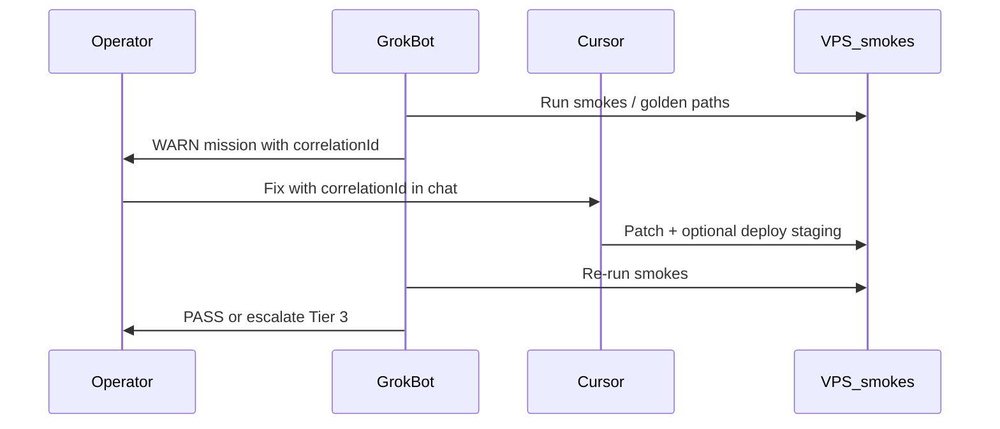

# Grok ↔ Cursor team protocol

Grok Bot is the **primary operator console** for daily and extreme ops. Cursor is the **build partner**. Use them **solo** or **together** — same hive rules either way.

Scorpion is **backend only** (register API, golden paths JSON). You do not need to open https://evenslouis.ca/scorpion during a normal 9–5.

---

## Three modes

### Solo Grok

**When:** Ops day, smokes, VPS checks, digests, research — no code changes.

| You | Grok | Cursor |
|-----|------|--------|
| Chat with Grok agents | smokes, golden paths, HITL links, n8n verify | closed |

**Start:** Open Grok Bot → Big Boss or lane agent → approve browser/SSH when prompted.

### Solo Cursor

**When:** Pure build/refactor session.

| You | Grok | Cursor |
|-----|------|--------|
| Code in Cursor | optional Watchdog cron (background) | primary |

**Load:** `docs/hive/outer-heaven/HIVEMIND_DNA.md` + latest chronicle tail.

### Team (recommended for incidents + fixes)

**When:** Grok finds a problem; Cursor patches; Grok verifies.



**Handoff phrase (paste into Cursor):**

```
Grok found: [summary]. correlationId: oh-XXXX.
Fix in repo, run typecheck. Grok will re-smoke when done.
```

---

## Extreme-case map (replaces Scorpion UI)

| Former Scorpion UI task | Grok agent | How |
|-------------------------|------------|-----|
| Golden paths / scoreboard | Watchdog Ops | Browser: `/api/hive/golden-paths` |
| Hive smokes 8/8 | Life & Business Ops | SSH: `smoke-life-business-ops.sh` |
| Tier 3 queue | HITL Operator | Browser: CE queue + missions API |
| n8n catalog verify | n8n Automation | Read `n8n-catalog.json` + VPS activate |
| CE health / leads | CE & Leads | Browser: `/pro/api/health` |
| Rollup / delegate | Big Boss | Daily digest mission |
| Builder smoke | Forge Builder | SSH: `smoke-ce-builder.sh` |
| Lead research | Scout Lead Gen | Read-only research → chronicle |

---

## What each tool owns

| Concern | Owner |
|---------|-------|
| Live verification | Grok (browser + SSH) |
| Code changes | Cursor |
| Money / send / deploy | Operator on `/pro` (Tier 3) |
| Register / audit trail | Scorpion API (automatic) |
| 24×7 fallback | Telegram / OpenClaw |

---

## Files both should read

1. `docs/hive/outer-heaven/OUTER_HEAVEN_LIBRARY.md`
2. `docs/hive/outer-heaven/HIVEMIND_DNA.md`
3. `docs/hive/outer-heaven/AUTOPILOT_CONTRACT.md`
4. `docs/hive/outer-heaven/NOTIFICATION_MATRIX.md`
5. Latest `CHRONICLE/YYYY-MM.md` tail

Grok: also `docs/hive/GROKBOT_ACCESS.md`.

---

## Anti-patterns

- Opening Scorpion UI when Grok can curl the same API
- Cursor claiming "done" without Grok smoke or live URL check
- Grok editing code without handing off to Cursor for repo changes
- Either tool auto-approving Tier 3 (money, send, deploy, secrets)
